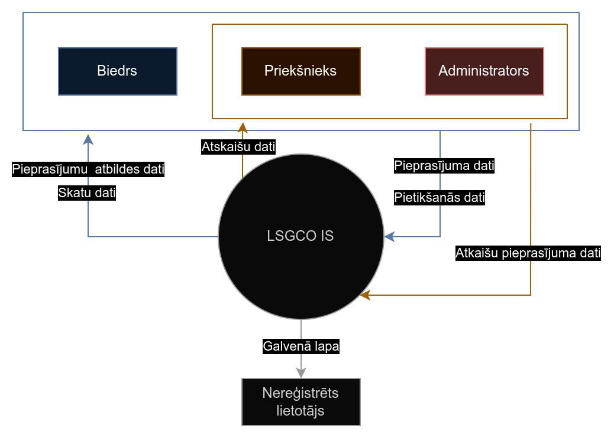
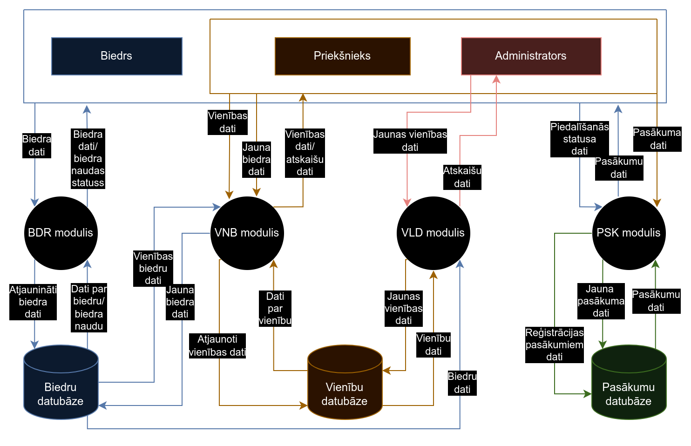
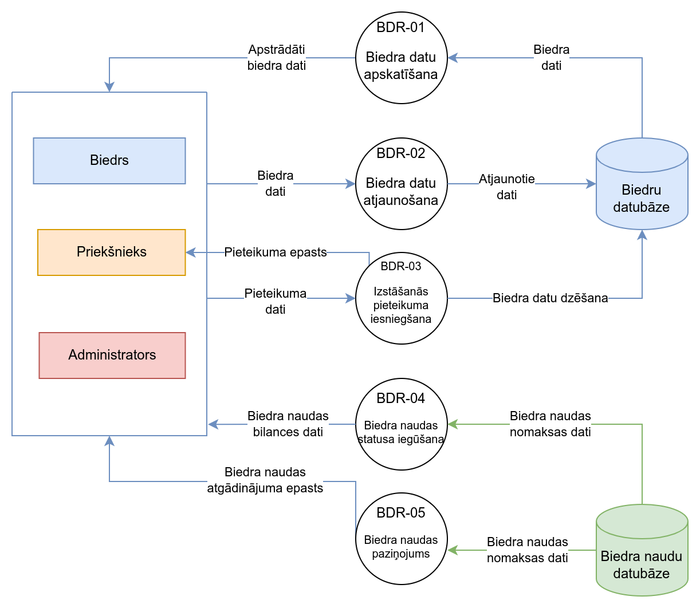
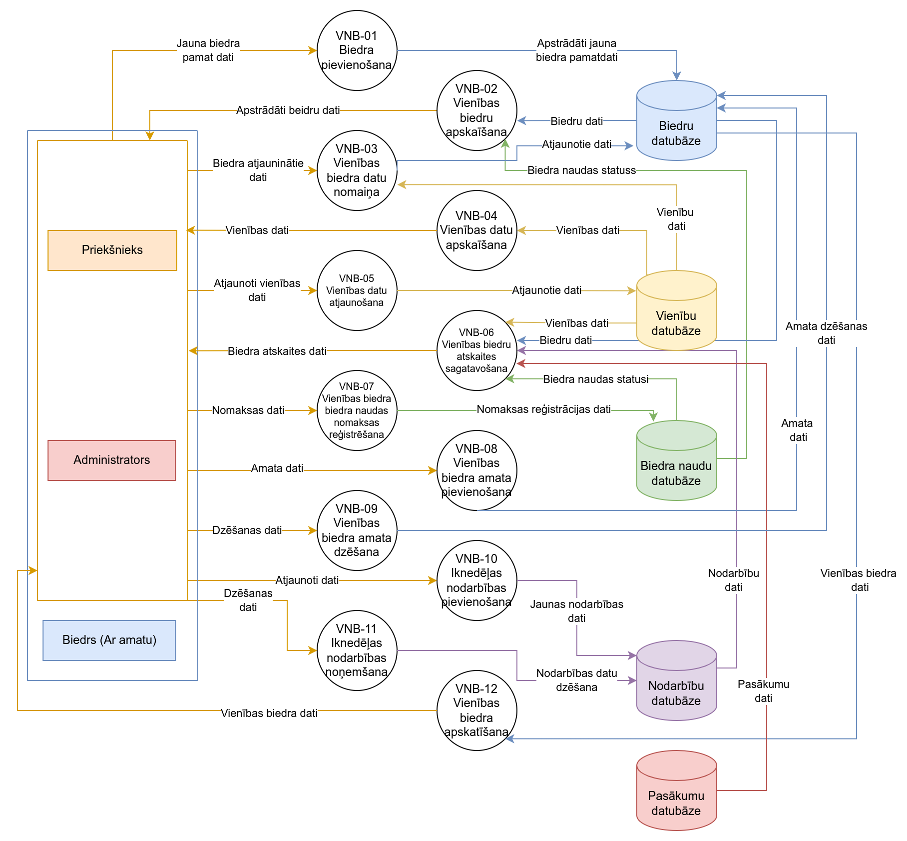
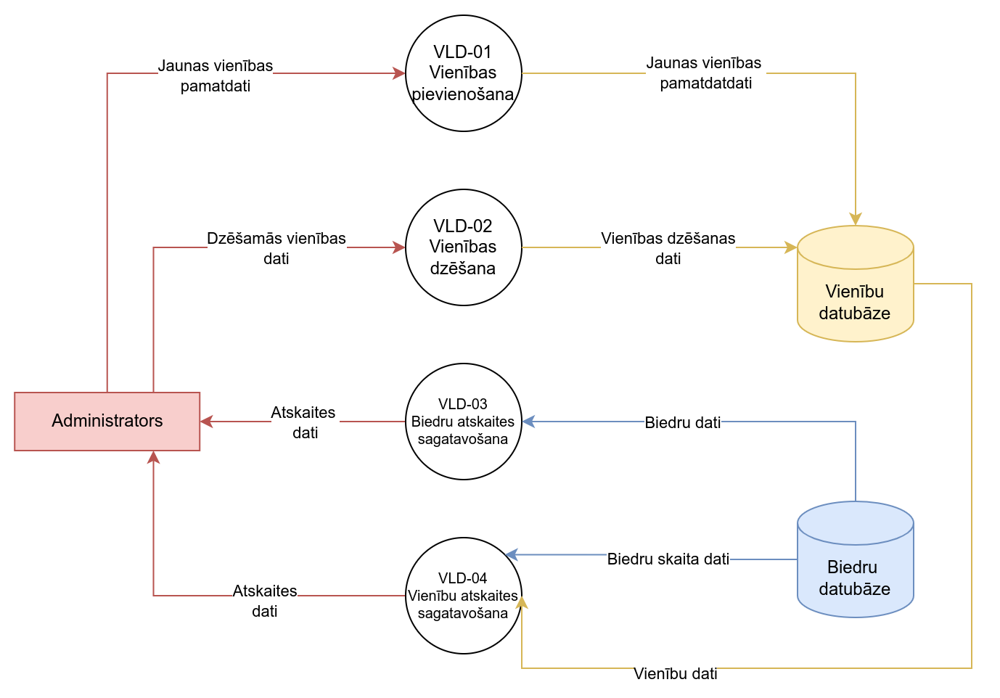
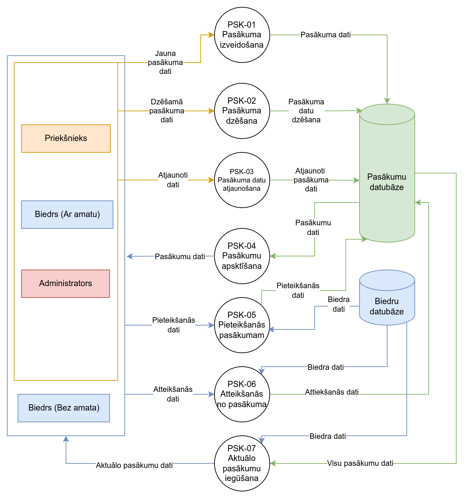
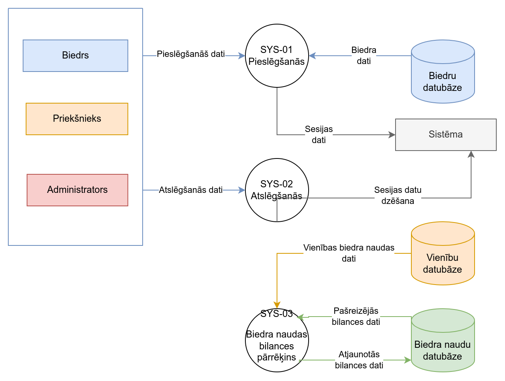
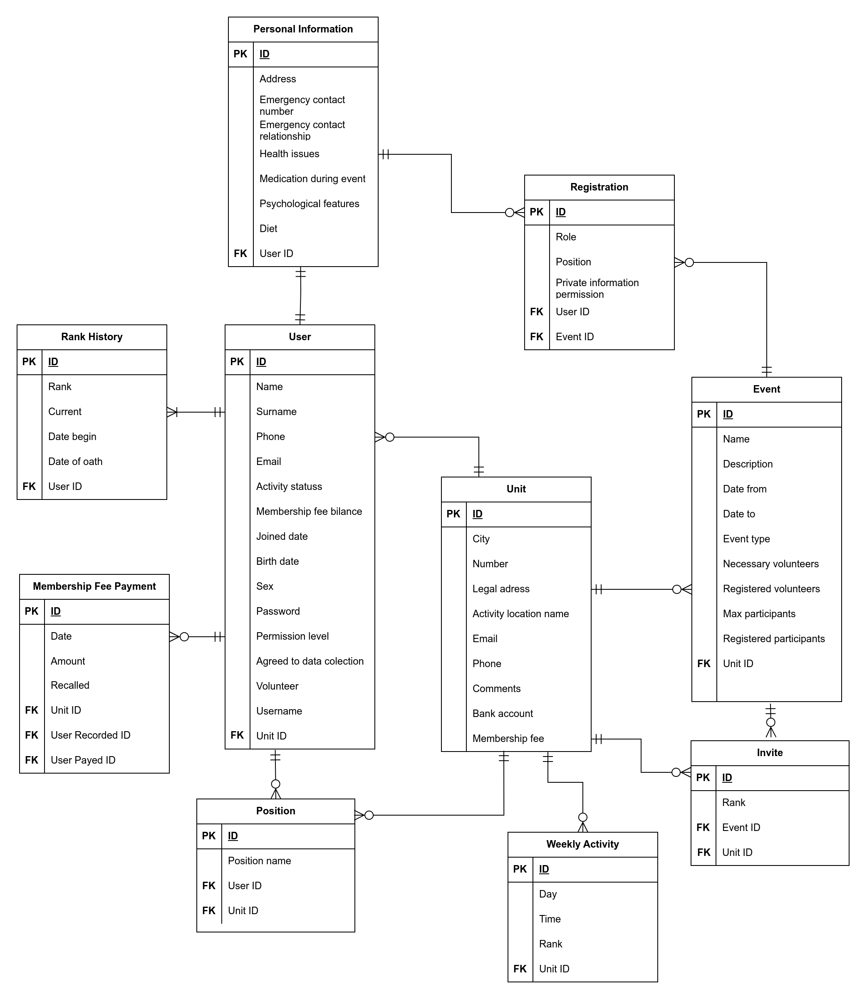
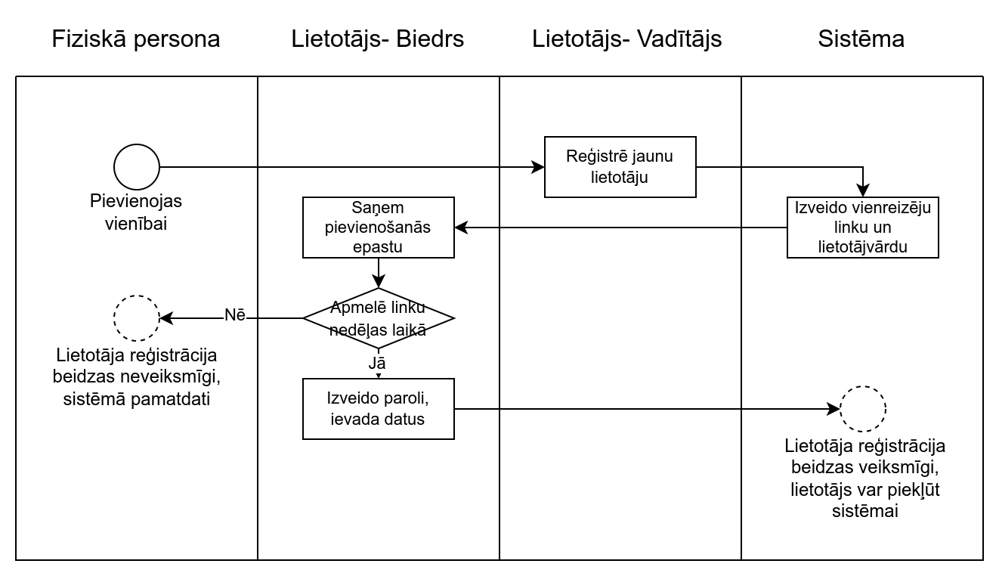
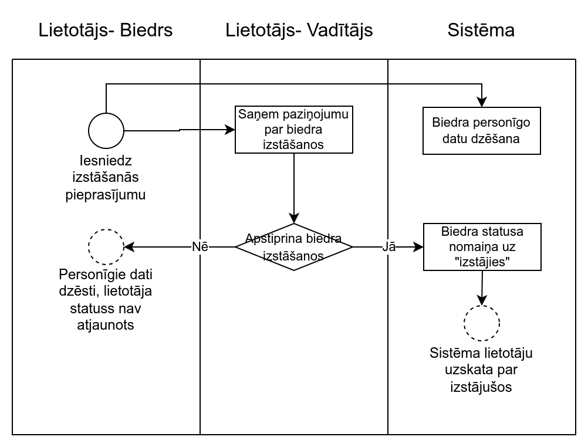

# LSGCO IS Dokumentācija

## Anotācija

Kvalifikācijas darba ietvaros ir izstrādāta informācijas sistēma kopā ar tās projektējumu, kas paredzēta Latvijas Skautu un Gaidu centrālajās organizācijas iekšējai lietošanai. Sistēmas galvenais mērķis ir optimizēt struktūrvienību darbību, samazinot nepieciešamību pēc ikgadējām atskaitēm un atvieglojot biedru un struktūrvienību aktivitāšu uzraudzību un pārvaldību. Tāpat sistēma palīdz informēt organizācijas biedrus par nenomaksātu biedra naudu un uzskaita informāciju par gaidāmajiem pasākumiem un iespējām palīdzēt to organizēšanā. Tāpat sistēma veic jaunu struktūrvienību izveidi, ko var veikt tikai administratori (biedri, kuri darbojas organizācijas nacionālajā līmenī), kā arī veido atskaites PDF un XLSX formātos. Sistēma ir izstrādāta tā, ka šī projekta ietvaros tiek izstrādāta sistēmas pamatfunkcionalitāte, ņemot vērā iespēju ieviest papildu funkcijas nākotnē.
**Atslēgas vārdi:** informācijas sistēma, jaunatnes organizācija, biedrzinība

## Abstract

Qualification work includes, an information system, along with its specification, that has been developed for internal use by the Latvian Scout and Guide Central Organization. The main goal of the system is to optimize the operations of units, reducing the need for annual reports and facilitating the monitoring and management of members and unit activities. Additionally, the system helps inform organization members about unpaid membership fees and keeps track of upcoming events and opportunities to assist in their organization. The system also allows the creation of new units, which can only be done by administrators (members working at the national level of the organization), and it generates reports in PDF and XLSX formats. The system is developed in such a way that only the core functionality of the system is being developed within the scope of this project, with the possibility of introducing additional features in the future.
**Key words:** information system, youth organization, member management

## Ievads

### Nolūks

Šis dokuments ir paredzēts, lai aprakstītu izstrādājamās sistēmas "Latvijas Skautu un Gaidu centrālās organizācijas" jeb "LSGCO IS" programmatūras prasības un projektējumu.  Šī sistēma ir paredzēta Latvijas Skautu un Gaidu centrālās organizācijas iekšējai lietošanai. Šajā dokumentā tiks detalizēti aprakstītas sistēmas produkta prasības, projektējums un funkcionalitāte, kā arī sistēmas izstrāde un testēšana.

### Darbības sfēra

Sistēma "LSGCO IS" ir tīmekļa lietotne, kas nodrošina datu uzskaiti un pārvaldīšanu organizācijas ietvaros. Sistēmas galvenais mērķis ir strādāt kā biedruzinības platformai, kura ļauj organizācijai un tās struktūrvienībām izsekot saviem biedriem, šo biedru statusam, biedra naudas bilances stāvoklim, kā arī biedru datu uzturēšanai. Tāpat sistēma uzturēs informāciju par dažādu struktūrvienību veidotiem pasākumiem, brīvprātīgajiem, kas tajos piedalās un kuri to organizē.
Dati sistēmā tiek glabāti ar to īpašnieku atļauju reģistrējoties sistēmā, kā arī pievienojoties biedrībai. Struktūrvienību vadītājiem ir iespējas iegūt atskaites par pasākumiem un biedriem noteiktā laika periodā. Nacionālā līmeņa vadītājiem ir iespēja iegūt atskaites par vienu vai vairākām struktūrvienībām noteiktā laika periodā. Reģistrēšanās sistēmai ir slēgta, tikai struktūrvienības vadītāja ierosināta. Biedrs pēc reģistrēšanās papildina datus par sevi (kurus vēlas izpaust). Sistēma nodrošinās arī e-pasta apziņošanas sistēmu, kas ļaus paziņot biedriem par biedra maksas kavējumiem.

### Saistība ar citiem dokumentiem

PPS ir izstrādāts atbilstoši standartam "LVS 68:1996 Programmatūras prasību specifikācijas ceļvedis".

PPA ir izstrādāts atbilstoši standartam "LVS 72:1996 Ieteicamā prakse programmatūras projektējuma aprakstīšanai".

### Pārskats

Dokumenta struktūru veido sekojošās daļas:

1. **Vispārīgs apraksts**, kas ietver
   
   - produkta aprakstu
   - pasūtītāju
   - 0.līmeņa datu plūsmas diagrammu
   - produkta perspektīvu
   - darījumprasības
   - sistēmas lietotājus
   - vispārējus ierobežojumus
   - pieņēmumus un atkarības.

2. **Programmatūras prasību specifikācija**, kurā norādītas
   
   - funkcionālās un nefunkcionālās prasības
   - datu bāzes ER diagramma
   - konceptuālais datu bāzes apraksts
   - 1.un 2.līmeņa datu plūsmas diagrammas
   - sistēmas moduļu sadalījums pēc funkcijām un funkciju apraksti.

3. **Programmatūras projektējuma apraksts**, kur aprakstīts
   
   - datu bāzes loģiskais un fiziskais modelis  
   - daļējs funkciju projektējums
   - lietotāja saskarņu projektējums

4. **Testēšanas pārskats**, kurš iekļauj
   
   - testēšanas procesa aprakstu
   - automatizēto vienībtestu dokumentāciju
   - sistēmtestēšanas testēšanas protokolu

5. **Projekta pārvaldības pārskats**

6. **Pielikumi**

## Apzīmējumu saraksts

**DB** - datubāze;
**ER** - entītiju relāciju;
**MB** - megabaits;
**PK** - primārā atslēga;
**FK** - ārējā atslēga;
**ID** - identifikators;

**LSGCO** - Latvijas Skautu un Gaidu centrālā organizācija
**Vienība** - LSGCO struktūrvienība

## 1 Vispārīgs apraksts

### 1.1 Esošā stāvokļa apraksts

LSGCO ir pāri 500 biedriem. Pašlaik biedru apzināšana un atskaites tiek veikta katrā vienībā atsevišķi lietojot excel tabulas. Tapēc tiek izstrādāts šis risinājums- informācijas sistēma, kura spēj uzskaitīt biedrus, sagatavot atskaites un vispārēji atvieglot struktūrvienību, kā arī organizācijas nacionālā līmeņa vadības darbu.

### 1.2 Pasūtītājs

Sistēma netiek veidota pēc pasūtījuma, bet pēc LSGCO biedra iniciatīvas kvalifikācijas darba ietvaros. Sistēmas izstrādes laikā tiek uzturēts dialogs ar LSGCO valdi, kā arī citiem biedriem, ar mērķi nākotnē ieviest šīs sistēmas lietošanu organizācijā.

### 1.3 Produkta perspektīva

Izstrādājamā sistēma ir pārsvarā neatkarīga un patstāvīga.

### 1.4 Darījumprasības

Sistēmai ir jānodrošina sekojošas funkcijas:

- Lietotāju reģistrācija, autentifikācija un autorizācija.
- Lietotāju datu izveidošana, dzēšana, rediģēšana, lasīšana.
- Vienību izveidošana, dzēšana, rediģēšana, lasīšana.
- Pasākmu izveidošana, dzēšana, rediģēšana, lasīšana.
- Lietotāju pievienošana/noņemšana no pasākumiem.
- Atskaišu ģenerēšana par biedru sastāvu, pasākumiem.
- Biedru naudas uzskaite, ziņojumi par kavētām biedra naudas iemaksām.
- Adaprīvais dizains telefona lietotājiem.

### 1.5 Sistēmas lietotāji

**Attēls 1.1.1.** *0. līmeņa datu plūsmas diagramma*
Kā redzams attēlā 1.1.1., sistēmas visi lietotāji tiek uzskatīti par Biedriem. Katra nākamā sistēmas lietotāja grupa iegūst jaunas tiesības, nezaudējot iepriekšējās. Sākot no Priekšnieka atļaujas līmeņa ir iespējams iegūt atskaites.

- Organizācijas biedrs (turpmāk Biedrs) - lietotājs, kurš spēj papildināt datus par sevi, pievienoties pasākumiem, saņemt paziņojumus par beidra naudām, apskatīt un pieteikties pasākumiem. Šim lietotājam ir piekļuve sistēmas "Biedrs" modulim un tā funkcijām, daļai no "Pasākums" moduļa funkcijām.
- Struktūrvienības vadītājs (turpmāk Priekšnieks) - lietotājs, kurš spēj veikt visas darbības ko Biedrs, bet arī pārvaldīt vienības biedrus un to statusu, izveidot jaunu biedru, izveidot atskaites par vienību, izveidot pasākumus. Šim lietotājam ir piekļuve sistēmas "Biedrs", "Pasākums" un "Vienība" moduļiem un to funkcijām.
- Nacionālā līmeņa biedrs (turpmāk Administrators) - lietotājs, kurš spēj veikt visas darbības ko Biedrs un Priekšnieks, bet arī pārvaldīt vienības, izveidot jaunu vienību, izveidot atskaites par organizāciju. Šim lietotājam ir piekļuve sistēmas "Biedrs", "Vienība", "Pasākums" un "Valde" moduļiem un to funkcijām.

### 1.6 Vispārējie ierobežojumi

- Lietotne ir veidota lietošanai tīmeklī Chrome, Firefox vai Safari pārlūkprogrammā.
- Sistēmas lietošanai ir nepieviešams stabils interneta savienojums.
- Valsts datu regulas ierobežojumi saistībā ar privātpersonu datu glabāšanu.

### 1.7 Pieņēmumi un atkarības

1. Lietotājam ir ierīce, kas spēj izmantot pārlūkprogrammu;
2. Lietotājam ir pieejams stabils interneta savienojums;
3. Serveris un DB ir nepārtraukti pieejams visiem lietotājiem;

## 2 Programmatūras prasību specifikācija

### 2.1 Datu bāzes apraksts

**Attēls 2.1.1.** *Konceptuālais datu bāzes modelis*
Attēlā 2.2.1 var redzēt datubāzes konceptuālo modeli, kurā ir redzamas savstarpējās attiecības sistēmas entitātēm.

### 2.2 Funkcionālās prasības

#### 2.2.2. Funkciju sadalījums pa moduļiem

**Attēls 2.2.1.** *1. līmeņa datu plūsmas diagramma*
Attēlā 2.2.1. ir redzama pirmā līmeņa datu plūsmas diagramma, kas atspoguļo sistēmas moduļu miejdarbību ar sistēmas lietotājiem un datubāzi. Pārskatāmības dēļ 1. līmenī DB ir abstraktētas vairākās datubāzēs, un tā neatspoguļo reālo datubāzes uzbūvi. Detalizētāks moduļu funkciju apraksts ir apskatāms zemāk tabulā 2.2.

Sistēma ir sadalīta 5 galvenajos moduļos. Šie moduļi ir sekojoši:

- "Biedrs" (**BDR**) modulis, kas ir domāts lietotāja personīgās informācijas uzturēšanai, labošanai un izmantošanai, kā arī biedra naudu izsekošanai.
  Funkciju sadalījums pa sistēmas moduļiem

- "Vienība" (**VNB**) modulis, kas ir domāts struktūrvienības informācijas uzturēšanai, labošanai un izmantošanai, jaunu biedru pievienošanai, kā arī vienības līmeņa atskaišu sagatavošanai.

- "Valde" (**VLD**) modulis, kas ir domāts organizācijas līmeņa atskaišu sagatavošanai, jaunu vienību izveidei.

- "Pasākums" (**PSK**) modulis, kas ir domāts pasākumu izveidei, uzturēšanai un izmantošanai, biedru pievienošanai pasākumu dalībnieku / organizatoru sarakstam.

- "Sistēma" (**SYS**) modulis, kas ir paredzēts sistēmas darbībām un autorizācijām.
  
  | Modulis | Funkcijas apzīmējums | Funkcija                                            | Lietotāji                           |
  | ------- | -------------------- | --------------------------------------------------- | ----------------------------------- |
  | BDR     | BDR-01               | Biedra datu apskatīšana                             | Biedrs, Priekšnieks, Administrators |
  |         | BDR-02               | Biedra datu atjaunošana                             | Biedrs, Priekšnieks, Administrators |
  |         | BDR-03               | Izstāšanās pieteikuma iesniegšana                   | Biedrs, Priekšnieks, Administrators |
  |         | BDR-04               | Biedra naudas statusa iegūšana                      | Biedrs, Priekšnieks, Administrators |
  |         | BDR-05               | Biedra naudas paziņojums                            | Autonoma funkcija                   |
  |         | BDR-06               | Biedra personīgo datu dzēšana                       | Biedrs, Priekšnieks, Administrators |
  |         | BDR-07               | Paroles izveide                                     | Biedrs, Priekšnieks, Administrators |
  | VNB     | VNB-01               | Biedra pievienošana                                 | Priekšnieks, Administrators         |
  |         | VNB-02               | Vienības biedru apskaīšana                          | Priekšnieks, Administrators         |
  |         | VNB-03               | Vienības biedra datu nomaiņa                        | Priekšnieks, Administrators         |
  |         | VNB-04               | Vienības datu apskaīšana                            | Priekšnieks, Administrators         |
  |         | VNB-05               | Vienības datu atjaunošana                           | Priekšnieks, Administrators         |
  |         | VNB-06               | Vienības biedru atskaites sagatavošana              | Priekšnieks, Administrators         |
  |         | VNB-07               | Vienības biedra biedra naudas nomaksas reģistrēšana | Priekšnieks, Administrators         |
  |         | VNB-08               | Vienības biedra amata pievienošana                  | Priekšnieks, Administrators         |
  |         | VNB-09               | Iknedēļas nodarbības pievienošana                   | Priekšnieks, Administrators         |
  |         | VNB-10               | Iknedēļas nodarbības izmainīšana                    | Priekšnieks, Administrators         |
  |         | VNB-11               | Iknedēļas nodarbības noņemšana                      | Priekšnieks, Administrators         |
  |         | VNB-12               | Vienības biedra apskatīšana                         | Priekšnieks, Administrators         |
  | VLD     | VLD-01               | Vienības pievienošana                               | Administrators                      |
  |         | VLD-02               | Vienības dzēšana                                    | Administrators                      |
  |         | VLD-03               | `Biedru` atskaites sagatavošana                     | Administrators                      |
  |         | VLD-04               | Vienības atjaunošana                                | Administrators                      |
  |         | VLD-05               | Organizācijas vienību apskatīšana                   | Administrators                      |
  | PSK     | PSK-01               | Pasākuma izveidošana                                | Priekšnieks, Administrators         |
  |         | PSK-02               | Pasākuma dzēšana                                    | Priekšnieks, Administrators         |
  |         | PSK-03               | Pasākuma datu atjaunošana                           | Priekšnieks, Administrators         |
  |         | PSK-04               | Pasākumu apsktīšana                                 | Biedrs, Priekšnieks, Administrators |
  |         | PSK-05               | Pieteikšanās pasākumam                              | Biedrs, Priekšnieks, Administrators |
  |         | PSK-06               | Atteikšanās no pasākuma                             | Biedrs, Priekšnieks, Administrators |
  |         | PSK-07               | Aktuālo pasākumu iegūšana                           | Biedrs, Priekšnieks, Administrators |
  | SYS     | SYS-01               | Pieslēgšanās                                        | Biedrs, Priekšnieks, Administrators |
  |         | SYS-02               | Atslēgšanās                                         | Biedrs, Priekšnieks, Administrators |
  |         | SYS-03               | Biedra naudas bilances pārrēķins                    | Autonoma funkcija                   |

**Tabula 2.2.2** *Funkciju sadalījums pa sistēmas moduļiem*

#### 2.2.2. Modulis "Biedrs"

**Attēls 2.2.3** *BDR moduļa 2. līmeņa DPD diagrama*

##### 2.2.2.1 Biedra datu apskatīšana (BDR-01)

| Funkcijas nosaukums | Biedra datu apskatīšana (BDR-01)                                                          |
| ------------------- | ----------------------------------------------------------------------------------------- |
| Funkcijas mērķis    | Lietotājs var apskatīt savus datus                                                        |
| Ievaddati           | Lietotāja ID (vesels skaitlis)                                                            |
| Apstrāde            | 1) No DB iegūst lietotāja ierakstu, kā arī tam piesaistīto privātās informācijas ieraksu. |
| Izvaddati           | Lietotāja ieraksta dati                                                                   |
| Paziņojumi          | -                                                                                         |

**Tabula 2.2.2.1** *Biedra datu apskatīšanas funkcijas projektējums*

##### 2.2.2.2 Biedra datu atjaunošana (BDR-02)

| Funkcijas nosaukums | Biedra datu atjaunošana (BDR-02)                                                                                                                                                                                                                                                                                                                                                                        |
| ------------------- | ------------------------------------------------------------------------------------------------------------------------------------------------------------------------------------------------------------------------------------------------------------------------------------------------------------------------------------------------------------------------------------------------------- |
| Funkcijas mērķis    | Lietotājs spēj atjaunot datus par sevi.                                                                                                                                                                                                                                                                                                                                                                 |
| Ievaddati           | Vārds (simbolu virkne);   Uzvārds (simbolu virkne);   Epasts (simbolu virkne ar @ simbolu);   Telefona numurs (8 simbolus gara simbolu virkne, kas satur tikai ciparus);   Dzimšanas datums (datums);   Dzimums (Vīrietis / Sieviete / Cits);   Piekrišana datu ievākšanai (patiesuma vērtība);  Brīvprātīgais (patiesuma vērtība);  Pašreizējā lietotāja ID (vesels skaitlis) |
| Apstrāde            | 1) No DB iegūstam pašreizējā lietotāja  ierakstu;   2) Atjaunojam lietotāja datus ar norādītajām vērtībām;   3) Saglabājam lietotājaierakstuu.                                                                                                                                                                                                                                                    |
| Izvaddati           | 1) Ja izdodas saglabāt lietotāju - tiek parādīts paziņojums 1.   2) Ja neizdodas saglabāt lietotāju- tiek parādīts paziņojums 2.                                                                                                                                                                                                                                                                     |
| Paziņojumi          | 1) Dati atjaunoti   2) Kļūda                                                                                                                                                                                                                                                                                                                                                                         |

**Tabula 2.2.2.2** *Biedra datu atjaunošanas funkcijas projektējums*

##### 2.2.2.3 Izstāšanās pieteikuma iesniegšana (BDR-03)

| Funkcijas nosaukums | Izstāšanās pieteikuma iesniegšana (BDR-03)                                                                                                                                                                                                                                                                                                                                                                                                                     |
| ------------------- | -------------------------------------------------------------------------------------------------------------------------------------------------------------------------------------------------------------------------------------------------------------------------------------------------------------------------------------------------------------------------------------------------------------------------------------------------------------- |
| Funkcijas mērķis    | Lietotājs spēj iesniegt paziņojumu, ka vēlas izstāties no organizācijas.                                                                                                                                                                                                                                                                                                                                                                                       |
| Ievaddati           | Pašreizējā lietotāja ID (vesels skaitlis);                                                                                                                                                                                                                                                                                                                                                                                                                 |
| Apstrāde            | 1) No DB iegūstam pašreizējā lietotāja ierakstu; 2) Lietotāja aktivitātes statusu atjauninam uz "Neaktīvs"; 2.1.) Ja lietotāja satuss sekmīgi atjaunināts, tad DB atrodam lietotāja vienības priekšnieku;  2.1.1) Vienības priekšniekam nosūtam e-pastu, kas satus: paziņojumu, ka lietotājs vēlas izstāties, linku uz lietotāja paneli. Funkcijas darbība ir veiksmīga. 2.2) Ja lietotāja satuss netiek atjaunināts, funkcija ir neveiksmīga. |
| Izvaddati           | 1) Funkcija ir veiksmīga- paziņojums ir nosūtīts, status atjaunots, tiek parādīts paziņojums 1.   2) Funkcija ir neveiksmīga- status nav atjaunots, tiek parādīts paziņojums 2.                                                                                                                                                                                                                                                                          |
| Paziņojumi          | 1) 'Jūsu iesniegums ir nosūtīts'   2) 'Kļūda'                                                                                                                                                                                                                                                                                                                                                                                                               |

**Tabula 2.2.2.3** *Izstāšanās pieteikuma iesniegšanas funkcijas projektējums*

##### 2.2.2.4 Biedra naudas statusa iegūšana (BDR-04)

| Funkcijas nosaukums | Biedra naudas statusa iegūšana (BDR-04)                                                                           |
| ------------------- | ----------------------------------------------------------------------------------------------------------------- |
| Funkcijas mērķis    | Lietotājs spēj iegūt savu pašreizējo bilansi                                                                      |
| Ievaddati           | Pašreizējā lietotāja ID (vesels skaitlis);                                                                        |
| Apstrāde            | 1) No DB iegūstam pašreizējā leitotāja  ierakstu;   2) Atgriež pašreizējo biedra naudas bilanses vērtību;   |
| Izvaddati           | Lietotāja pašreizējās bilanses dati                                                                               |
| Paziņojumi          | -                                                                                                                 |

**Tabula 2.2.2.4** *Biedra naudas statusa iegūšanas funkcijas projektējums*

##### 2.2.2.5 Biedra naudas paziņojums (BDR-05)

| Funkcijas nosaukums | Biedra naudas paziņojums (BDR-05)                                                                                                                                                                                                                                                                                                      |
| ------------------- | -------------------------------------------------------------------------------------------------------------------------------------------------------------------------------------------------------------------------------------------------------------------------------------------------------------------------------------- |
| Funkcijas mērķis    | Lietotājam tiek nosūtīts paziņojums, par biedra naudas parādu.                                                                                                                                                                                                                                                                     |
| Ievaddati           | Pašreizējā lietotāja ID (vesels skaitlis);                                                                                                                                                                                                                                                                                             |
| Apstrāde            | 1) No DB iegūstam pašreizējā lietotāja ierakstu; 2) Iegūstam pašreizējā lietotāja pēdējā maksājuma datus; 3) Uz lietotāja epastu tiek nosūtīts epasts, kas satur: paziņojumu, ka biedrs nav maksājis biedra naudu, pēdējā maksājuma datumu un summu, parāda summu, vienības kontu, vienības priekšnieka telefona nummuru.  |
| Izvaddati           | Epasts uz lietotāja epastu                                                                                                                                                                                                                                                                                                             |
| Paziņojumi          | -                                                                                                                                                                                                                                                                                                                                      |

**Tabula 2.2.2.5** *Biedra naudas paziņojuma funkcijas projektējums*

##### 2.2.2.6 Biedra personīgo datu dzēšana (BDR-06)

| Funkcijas nosaukums | Biedra personīgo datu dzēšana (BDR-06)                                                                                                                                                                    |
| ------------------- | --------------------------------------------------------------------------------------------------------------------------------------------------------------------------------------------------------- |
| Funkcijas mērķis    | Lietotājs spēj izdzēst savus personīgos datus (veselības informācija, kontakttalruņi). Tas neietver lietotāja pamatinformāciju.                                                                           |
| Ievaddati           | Lietotāja ID (vesels skaitlis);                                                                                                                                                                           |
| Apstrāde            | 1) No DB dzēšam personīgo informāciju, kas ir piesaistīta lietotājam.                                                                                                                                     |
| Izvaddati           | 1) Funkcija ir veiksmīga- personīgās informācijas ieraksts ir idzēsts, tiek parādīts paziņojums 1.   2) Funkcija ir neveiksmīga- radusies kļūda, ieraksts nav dzēsts, tiek parādīts paziņojums 2.   |
| Paziņojumi          | 1) 'Aptaujas lapa dzēsta.' 2) 'Kļūda'                                                                                                                                                                 |

**Tabula 2.2.2.6** *Biedra personīgo datu dzēšanas funkcijas projektējums*

##### 2.2.2.7 Paroles izveide (BDR-07)

| Funkcijas nosaukums | Paroles izveide (BDR-07)                                                                                                                                                                                                                                                                                                                                                                                                                                                                                    |
| ------------------- | ----------------------------------------------------------------------------------------------------------------------------------------------------------------------------------------------------------------------------------------------------------------------------------------------------------------------------------------------------------------------------------------------------------------------------------------------------------------------------------------------------------- |
| Funkcijas mērķis    | Jauns lietotājs spēj izveidot savu paroli                                                                                                                                                                                                                                                                                                                                                                                                                                                                   |
| Ievaddati           | Lietotāja ID (vesels skaitlis);   Vecā parole (simbolu virkne);   Jaunā parole (simbolu virkne);   Jaunās paroles atkārtojums (simbolu virkne);                                                                                                                                                                                                                                                                                                                                                    |
| Apstrāde            | 1) DB tiek atrasts lietotājs ar norādīto lietotāja ID;   2) Pārbauda vai atkārtotā parole sakrīt ar jauno paroli;  2.1) Ja jaunā parole un tās atkārtojums sakrīt, pārbauda vai šī lietotāja parole sakrīt ar norādīto veco paroli;   2.1.1) Ja paroles sakrīt, tad lietotāja parole tiek atjaunota uz norādīto jauno paroli. Funkcija ir veiksmīga;   2.1.2) Ja paroles nesakrīt, tad funkcija ir neveiksmīga;   2.2) Ja jaunā parole un tās atkārtojums nesakrīt funkcija tiek pārtraukta. |
| Izvaddati           | 1) Funkcija ir veiksmīga- lietotāja parole ir atjaunota, tiek parādīts paziņojums 1.   2) Funkcija ir pārtraukta- lietotāja parole netiek atjaunota, tiek parādīts paziņojums 2.   3) Funkcija ir neveiksmīga-lietotāja parole netiek atjaunota, tiek parādīts paziņojums 3.                                                                                                                                                                                                                          |
| Paziņojumi          | 1)  'Parole izveidota'   2) 'Paroles nesakrīt'   3) 'Kļūda'                                                                                                                                                                                                                                                                                                                                                                                                                                           |

**Tabula 2.2.2.7** *Paroles izveides funkcijas projektējums*

#### 2.2.3. Modulis "Vienība"

**Attēls 2.2.4** *VNB moduļa 2. līmeņa DPD diagrama*

##### 2.2.3.1 Biedra pievienošana (VNB-01)

| Funkcijas nosaukums | Biedra pievienošana (VNB-01)                                                                                                                                                                                                                                                                                                                                                                                                                                                                                                                                                                                                                         |
| ------------------- | ---------------------------------------------------------------------------------------------------------------------------------------------------------------------------------------------------------------------------------------------------------------------------------------------------------------------------------------------------------------------------------------------------------------------------------------------------------------------------------------------------------------------------------------------------------------------------------------------------------------------------------------------------- |
| Funkcijas mērķis    | Priekšnieks spēj savai vienībai pievienot jaunu biedru.                                                                                                                                                                                                                                                                                                                                                                                                                                                                                                                                                                                              |
| Ievaddati           | Vārds (simbolu virkne);   Uzvārds (simbolu virkne);   Epasts (simbolu virkne);   Pievienošanās datums (datums);   Status (Aktīvs/Interesents/Vadītājs/Vecbiedrs/Izstājies);   Pakāpe ('MZSK/GNT' / 'SK/G' / 'DZSK/DZG' / 'ROV/LG' / 'VAD' / 'VIEDSK/VIEDG' / 'CITS');   Aktīvais lietotājs (lietotāja ieraksts).                                                                                                                                                                                                                                                                                                                |
| Apstrāde            | 1) Tiek izveidots jauns lietotāja ieraksts ar ievaddatu vērtībām (vārds, uzvārds, epasts, pievienošanās datums, status, pakāpe) zem aktīvā lietotāja vienības. Ja rodas problēmas validējot datus, tiek parādīti sistēmas ģenerētie paziņojumi.   2) Jaunajam lietotājam tiek uzģenerēta pagaidu parole.   3) Jaunajam lietotājam tiek uzģenerēts lietotājvārds (VārdsUzvārds + Vienības numurs). 4) Jaunais lietotājs tiek saglabāts DB.   4.1) Ja lietotājs tiek saglbāts veiksmīgi, lietotājam tiek nosūtīts epasts ar linku paroles izveidei, funkcija ir veiksmīga.   4.2) Ja lietotājs netiek saglabāts, funkcija ir neveiksmīga. |
| Izvaddati           | 1) Funkcija ir veiksmīga- lietotājs tiek novirzīts uz sākuma skatu, tiek parādīts paziņojums 1.   2) Funkcija ir neveiksmīga- lietotājs tiek novirzīts uz sākuma skatu, tiek parādīts paziņojums 2.                                                                                                                                                                                                                                                                                                                                                                                                                                               |
| Paziņojumi          | 1) Biedrs pievienots   2) Kļūda                                                                                                                                                                                                                                                                                                                                                                                                                                                                                                                                                                                                                   |

**Tabula 2.2.3.1** *Biedra pievienošanas funkcijas projektējums*

##### 2.2.3.2 Vienības biedru apskatīšana (VNB-02)

| Funkcijas nosaukums | Vienības biedru apskatīšana (VNB-02)                                          |
| ------------------- | ----------------------------------------------------------------------------- |
| Funkcijas mērķis    | Vienības priekšnieks spēja apskatīt savas vienības biedrus                    |
| Ievaddati           | Vienības ID (vesels skaitlis);                                                |
| Apstrāde            | 1) No DB iegūstam visus biedru ierakstus, kuru vienība sakrīt ar vienības ID. |
| Izvaddati           | Vienības lietotāju dati.                                                      |
| Paziņojumi          | -                                                                             |

**Tabula 2.2.3.2** *Vienības biedru apskatīšanas funkcijas projektējums*

##### 2.2.3.3 Vienības biedra datu nomaiņa (VNB-03)

| Funkcijas nosaukums | Vienības biedra datu nomaiņa (VNB-03)                                                                                                                                                                                                                                                                                                                                                                                                                                                                                                                                                                                                                                                                                                         |
| ------------------- | --------------------------------------------------------------------------------------------------------------------------------------------------------------------------------------------------------------------------------------------------------------------------------------------------------------------------------------------------------------------------------------------------------------------------------------------------------------------------------------------------------------------------------------------------------------------------------------------------------------------------------------------------------------------------------------------------------------------------------------------- |
| Funkcijas mērķis    | Vienības priekšnieks spēj atjaunot datus par savas vienības biedru.                                                                                                                                                                                                                                                                                                                                                                                                                                                                                                                                                                                                                                                                           |
| Ievaddati           | Aktivitātes status (aktīvs/daļēji_aktīvs/interesents/vadītājs/vecbiedrs/neaktīvs/izstājies);  Pakāpe (mzsk_gnt/sk_g/dzsk_dzg/rov_lg/vad/viedsk_viedg/cits);  Solījuma datums (datums);   Lietotāja ID (vesels skaitlis);                                                                                                                                                                                                                                                                                                                                                                                                                                                                                                             |
| Apstrāde            | 1) No DB iegūstam pašreizējā lietotāja  ierakstu;   2.1.1) Ja ir norādīts aktivitātes status, tad atjaunojam šo lietotāja ieraksta vērtību. 2.1.2)Funkcija ir veiksmīga, ja ieraksts tiek veiksmīgi saglabāts, lietotājam parādās paziņojums 1.  2.2.1) Ja ir norādīta pakāpe, izveidojam pakāpes ierakstu, kas saistīts ar lietotāja ierakstu. 2.2.2)Funkcija ir veiksmīga, ja ierakst tiek veiksmīgi saglabāts, lietotājam parādās paziņojums 2.  2.3.1) Ja ir norādīs solījuma datums, atrodam lietotāja aktīvo pakāpes ierakstu. 2.3.2)Pakāpes ierakstā izmainam solījuma datuma vērtību uz norādīto  2.3.3)Funkcija ir veiksmīga, ja ierakst tiek veiksmīgi saglabāts, lietotājam parādās paziņojums 3.   |
| Izvaddati           | 1) Ja funkcija ir veiksmīga - tiek parādīts paziņojums 1-3.   2) Ja neizdodas saglabāt lietotāju- tiek parādīts paziņojums 4.                                                                                                                                                                                                                                                                                                                                                                                                                                                                                                                                                                                                              |
| Paziņojumi          | 1) 'Aktivitātes status nomainīts'  2) 'Pakāpe nomainīta' 3) 'Solījums atzīmēts'  4) 'Ķļūda'                                                                                                                                                                                                                                                                                                                                                                                                                                                                                                                                                                                                                                        |

**Tabula 2.2.3.3** *Vienības biedra vienības nomaiņas funkcijas projektējums*

##### 2.2.3.4 Vienības datu apskatīšana (VNB-04)

| Funkcijas nosaukums | Vienības datu apskatīšana (VNB-04)                                                                                                                                                                                                                                                                        |
| ------------------- | --------------------------------------------------------------------------------------------------------------------------------------------------------------------------------------------------------------------------------------------------------------------------------------------------------- |
| Funkcijas mērķis    | Vienības priekšnieks var apskatīt savas vienības datus.                                                                                                                                                                                                                                                   |
| Ievaddati           | Vienības ID (vesels skaitlis)                                                                                                                                                                                                                                                                             |
| Apstrāde            | 1) No DB iegūst vienības ierakstu.  2) No DB iegūstam vienības priekšnieka lietotāja ierakstu (pirmais lietotājs, kura piekļuve ir Priekšnieks, vai kura piekļuve ir Valde, kura aktivitātes status ir Vadītājs) 3) No DB iegūstam vienības iknedēļas nodarbību ierakstus. 4) Atgriežam datus |
| Izvaddati           | Vienības ieraksta dati + Vienības priekšnieka dati + Iknedēļas nodarbību dati                                                                                                                                                                                                                             |
| Paziņojumi          | -                                                                                                                                                                                                                                                                                                         |

**Tabula 2.2.3.4** *Vienības datu apskatīšanas funkcijas projektējums*

##### 2.2.3.5 Vienības datu atjaunošana (VNB-05)

| Funkcijas nosaukums | Vienības datu atjaunošana (VNB-05)                                                                                                                                                                                                                                                                                                                                                                                              |
| ------------------- | ------------------------------------------------------------------------------------------------------------------------------------------------------------------------------------------------------------------------------------------------------------------------------------------------------------------------------------------------------------------------------------------------------------------------------- |
| Funkcijas mērķis    | Vienības priekšnieks spēj atjaunot datus par savu vienību.                                                                                                                                                                                                                                                                                                                                                                      |
| Ievaddati           | Juridiskā adrese (simbolu virkne);  Nodarbību adrese (simbolu virkne);  Komentāri (simbolu virkne);  Epasts (simbolu virkne, kas satur @ simbolu);  Telefons (simbolu virkne, kas satur tikai skaitļus);  Bankas konts (simbolu virkne, kas atbilst bankas konta nummuram);  Biedra nauda (skaitlis ar 2 zīmēm pēc komata);  Vienības priekšnieka ID (vesels skaitlis)  Vienības ID (vesels skaitlis); |
| Apstrāde            | 1) No DB iegūstam vienības un vienības priekšnieka ierakstu;  2)  Atjaunojam vienības ieraksta vērtības. 3)  Ja norādītais vienības priekšnieks nesakrīt ar pašreizējo, norādītā vienības priekšnieka ierakstam mainam piekļuves uz Vadītājs 4) Funkcija ir veiksmīga, ja abi ieraksti tiek veiksmīgi saglabāts.                                                                                                 |
| Izvaddati           | 1) Ja funkcija ir veiksmīga - tiek parādīts paziņojums 1.   2) Ja funkcija ir neveiksmīga- tiek parādīts paziņojums 2.                                                                                                                                                                                                                                                                                                       |
| Paziņojumi          | 1) 'Vienības infromācija atjaunota'  2) 'Kļūda'                                                                                                                                                                                                                                                                                                                                                                          |

**Tabula 2.2.3.5** *Vienības datu atjaunošanas funkcijas projektējums*

##### 2.2.3.6 Vienības biedru atskaites sagatavošana (VNB-06)

| Funkcijas nosaukums | Vienības biedru atskaites sagatavošana (VNB-06) |
| ------------------- | ----------------------------------------------- |
| Funkcijas mērķis    |                                                 |
| Ievaddati           |                                                 |
| Apstrāde            |                                                 |
| Izvaddati           |                                                 |
| Paziņojumi          |                                                 |

**Tabula 2.2.3.5** *Vienības biedru atskaites sagatavošanas funkcijas projektējums*

##### 2.2.3.7 Vienības biedra biedra naudas nomaksas reģistrēšana (VNB-07)

| Funkcijas nosaukums | Vienības biedra biedra naudas nomaksas reģistrēšana (VNB-07)                                                                                                                                                                                                                    |
| ------------------- | ------------------------------------------------------------------------------------------------------------------------------------------------------------------------------------------------------------------------------------------------------------------------------- |
| Funkcijas mērķis    | Vienības priekšnieks var reģistrēt biedra naudas nomaksas faktu.                                                                                                                                                                                                                |
| Ievaddati           | Lietotāja ID (vesels skaitlis); Vienības priekšnieka ID (vesels skaitlis); Datums (datums); Summa (skaitlis ar 2 zīmēm pēc komata);                                                                                                                                 |
| Apstrāde            | 1) No DB iegūstam lietotāja un vienības priekšnieka ierakstus. 2) Izveidojam jaunu maksājuma ierakstu, ar norādīto summu un datumu, kur to veicis ir lietotājs un reģistrējis vienībās priekšnieks. 3) Funkcija ir veiksmīga, ja šis ieraksts tiek veiksmīgi saglabāts. |
| Izvaddati           | 1) Ja funkcija ir veiksmīga - tiek parādīts paziņojums 1.   2) Ja funkcija ir neveiksmīga- tiek parādīts paziņojums 2.                                                                                                                                                       |
| Paziņojumi          | 1) 'Maksājums reģistrēts' 2) 'Kļūda'                                                                                                                                                                                                                                        |

**Tabula 2.2.3.7** *Vienības biedra biedra naudas nomaksas reģistrēšanas funkcijas projektējums*

##### 2.2.3.8 Vienības biedra amata pievienošana (VNB-08)

| Funkcijas nosaukums | Vienības biedra amata pievienošana (VNB-08)                                                                                                                                                                       |
| ------------------- | ----------------------------------------------------------------------------------------------------------------------------------------------------------------------------------------------------------------- |
| Funkcijas mērķis    | Vienības priekšnieks var pievienot vienības biedram amatu.                                                                                                                                                        |
| Ievaddati           | Lietotāja ID (vesels skaitlis); Amata nosaukums (simbolu virkne)                                                                                                                                          |
| Apstrāde            | 1) No DB iegūstam lietotāja ierakstu. 2) Izveidojam jaunu amata ierakstu, kas piesaistīts lietotāja ierakstam, ar norādīto nosaukumu. 3) Funkcija ir veiksmīga, ja šis ieraksts tiek veiksmīgi saglabāts. |
| Izvaddati           | 1) Ja funkcija ir veiksmīga - tiek parādīts paziņojums 1.   2) Ja funkcija ir neveiksmīga- tiek parādīts paziņojums 2.                                                                                         |
| Paziņojumi          | 1) 'Amats izveidots' 2) Kļūda''                                                                                                                                                                               |

**Tabula 2.2.3.8** *Vienības biedra amata pievienošanas funkcijas projektējums*

##### 2.2.3.9 Vienības biedra amata dzēšana (VNB-09)

| Funkcijas nosaukums | Iknedēļas nodarbības pievienošana (VNB-09)                                                                                |
| ------------------- | ------------------------------------------------------------------------------------------------------------------------- |
| Funkcijas mērķis    | Vienības priekšnieks var noņemt vienības biedram amatu.                                                                   |
| Ievaddati           | Amata ID (vesels skaitlis);                                                                                           |
| Apstrāde            | 1) No DB iegūstam amata ierakstu; 2) Funkcija ir veiksmīga, ja ieraksts tiek veiksmīgi dzēsts.                        |
| Izvaddati           | 1) Ja funkcija ir veiksmīga - tiek parādīts paziņojums 1.   2) Ja funkcija ir neveiksmīga- tiek parādīts paziņojums 2. |
| Paziņojumi          | 1) 'Amats dzēsts' 2) Kļūda''                                                                                          |

**Tabula 2.2.3.9** *Vienības biedra amata dzēšanas funkcijas projektējums*

##### 2.2.3.10 Iknedēļas nodarbības pievienošana (VNB-10)

| Funkcijas nosaukums | Iknedēļas nodarbības pievienošana (VNB-10)                                                                                                                                                                                      |
| ------------------- | ------------------------------------------------------------------------------------------------------------------------------------------------------------------------------------------------------------------------------- |
| Funkcijas mērķis    | Vienības priekšnieks var pievienot vienības iknedēļas nodarbību.                                                                                                                                                                |
| Ievaddati           | Vienības ID (vesels skaitlis); Diena (nedēļas diena) Laiks (laiks formātā HH:MM) Pakāpe(mazskauti_guntiņas/skauti_gaidas/dižskauti_dižgaidas/roveri_lielgaidas)                                                 |
| Apstrāde            | 1) No DB iegūstam vienības ierakstu. 2) Izveidojam jaunu iknedēļas nodarbības ierakstu, kas piesaistīts vienības ierakstam, ar norādītajiem datiem. 3) Funkcija ir veiksmīga, ja šis ieraksts tiek veiksmīgi saglabāts. |
| Izvaddati           | 1) Ja funkcija ir veiksmīga - tiek parādīts paziņojums 1.   2) Ja funkcija ir neveiksmīga- tiek parādīts paziņojums 2.                                                                                                       |
| Paziņojumi          | 1) 'Iknedēļas nodarbība izveidota' 2) Kļūda''                                                                                                                                                                               |

**Tabula 2.2.3.10** *Iknedēļas nodarbības pievienošanas funkcijas projektējums*

##### 2.2.3.11 Iknedēļas nodarbības noņemšana (VNB-11)

| Funkcijas nosaukums | Iknedēļas nodarbības noņemšana (VNB-11)                                                                                   |
| ------------------- | ------------------------------------------------------------------------------------------------------------------------- |
| Funkcijas mērķis    | Vienības priekšnieks var noņemt vienības iknedēļas nodarbību.                                                             |
| Ievaddati           | Iknedēļas nodarbības ID (vesels skaitlis);                                                                            |
| Apstrāde            | 1) No DB iegūstam iknedēļas nodarbības ierakstu; 2) Funkcija ir veiksmīga, ja ieraksts tiek veiksmīgi dzēsts.         |
| Izvaddati           | 1) Ja funkcija ir veiksmīga - tiek parādīts paziņojums 1.   2) Ja funkcija ir neveiksmīga- tiek parādīts paziņojums 2. |
| Paziņojumi          | 1) 'Iknedēļas nodarbība dzēsta' 2) Kļūda''                                                                            |

**Tabula 2.2.3.11** *Iknedēļas nodarbības noņemšanas funkcijas projektējums*

##### 2.2.3.12 Vienības biedra apskatīšana (VNB-12)

| Funkcijas nosaukums | Vienības biedra apskatīšana (VNB-12)                                                                                                                       |
| ------------------- | ---------------------------------------------------------------------------------------------------------------------------------------------------------- |
| Funkcijas mērķis    | Vienības priekšnieks spēj apskatīt atsevišķa biedra datus.                                                                                                 |
| Ievaddati           | Biedra ID (vesels skaitlis)                                                                                                                                |
| Apstrāde            | 1) No DB iegūstam biedra ierakstu. 2) No DB iegūstam amata ierakstus, kas ir piesaistīti biedram. 3) Iegūstam pakāpes, kurās biedrs vel nav bijis. |
| Izvaddati           | Biedra dati + amatu dati + nākotnes pakāpes                                                                                                                |
| Paziņojumi          | -                                                                                                                                                          |

**Tabula 2.2.3.12** *Novadītas nodarbības atzīmēšanas funkcijas projektējums*

#### 2.2.4. Modulis "Valde"

**Attēls 2.2.5** *VLD moduļa 2. līmeņa DPD diagrama*

##### 2.2.4.1 Vienības pievienošana (VLD-01)

| Funkcijas nosaukums | Vienības pievienošana (VLD-01)                                                                                                                                                                                                                                                                                      |
| ------------------- | ------------------------------------------------------------------------------------------------------------------------------------------------------------------------------------------------------------------------------------------------------------------------------------------------------------------- |
| Funkcijas mērķis    | Valdes loceklis spēj izveidot jaunu vienību.                                                                                                                                                                                                                                                                        |
| Ievaddati           | Pilsēta (simbolu virkne) Cipars (vesels skaitlis) Juridiskā adrese (simbolu virkne);  Bankas konts (simbolu virkne, kas atbilst bankas konta nummuram);  Vienības priekšnieka ID (vesels skaitlis);                                                                                                   |
| Apstrāde            | 1) No DB iegūstam vienības priekšnieka ierakstu. Šim ierakstam ir jābūt ar aktivitātes statusu Vadītājs. 2) Izveidojam jaunu vienības ierakstu ar ievaddatiem. 3) Vienības priekšnieka ierakstam nomainam piekļuvi uz Vadītājs. 4) Funkcija ir veiksmīga, ja jaunais ieraksts tiek veiksmīgi saglabāts. |
| Izvaddati           | 1) Ja funkcija ir veiksmīga - tiek parādīts paziņojums 1.   2) Ja funkcija ir neveiksmīga- tiek parādīts paziņojums 2.                                                                                                                                                                                           |
| Paziņojumi          | 1) 'Jauna vienība izveidota' 2) 'Ķļūda'                                                                                                                                                                                                                                                                         |

**Tabula 2.2.4.1** *Vienības pievienošanas funkcijas projektējums*

##### 2.2.4.2 Vienības nestingrā dzēšana (VLD-02)

| Funkcijas nosaukums | Vienības dzēšana (VLD-02)                                                                                                                                       |
| ------------------- | --------------------------------------------------------------------------------------------------------------------------------------------------------------- |
| Funkcijas mērķis    | Valdes loceklis spēj atjaunot vienību.                                                                                                                          |
| Ievaddati           | Vienības ID (vesels skaitlis);                                                                                                                                  |
| Apstrāde            | 1) No DB iegūstam vienības ierakstu. 2) Vienības ierakstā ievada dzēšanas datuma lauku. 4) Funkcija ir veiksmīga, ja ieraksts tiek veiksmīgi saglabāts. |
| Izvaddati           | 1) Ja funkcija ir veiksmīga - tiek parādīts paziņojums 1.   2) Ja funkcija ir neveiksmīga- tiek parādīts paziņojums 2.                                       |
| Paziņojumi          | 1) 'Vienības atzīmēta kā neaktīva' 2) 'Kļūda'                                                                                                               |

**Tabula 2.2.4.2** *Vienības dzēšanas funkcijas projektējums*

##### 2.2.4.3 Biedru atskaites sagatavošana (VLD-03)

| Funkcijas nosaukums | Biedru atskaites sagatavošana (VLD-03) |
| ------------------- | -------------------------------------- |
| Funkcijas mērķis    |                                        |
| Ievaddati           |                                        |
| Apstrāde            |                                        |
| Izvaddati           |                                        |
| Paziņojumi          |                                        |

**Tabula 2.2.4.3** *Biedru atskaites sagatavošanas funkcijas projektējums*

##### 2.2.4.4 Vienības atjaunošana (VLD-04)

| Funkcijas nosaukums | Vienības atjaunošana (VLD-04)                                                                                                                                   |
| ------------------- | --------------------------------------------------------------------------------------------------------------------------------------------------------------- |
| Funkcijas mērķis    | Valdes loceklis spēj iepriekš "dzēstu" vienību atjaunot.                                                                                                        |
| Ievaddati           | Vienības ID (vesels skaitlis);                                                                                                                                  |
| Apstrāde            | 1) No DB iegūstam vienības ierakstu. 2) Vienības ierakstā notīra dzēšanas datuma lauku. 4) Funkcija ir veiksmīga, ja ieraksts tiek veiksmīgi saglabāts. |
| Izvaddati           | 1) Ja funkcija ir veiksmīga - tiek parādīts paziņojums 1.   2) Ja funkcija ir neveiksmīga- tiek parādīts paziņojums 2.                                       |
| Paziņojumi          | 1) 'Vienības atzīmēta kā aktīva' 2) 'Kļūda'                                                                                                                 |

**Tabula 2.2.4.4** *Vienības atjaunošanas funkcijas projektējums*

##### 2.2.4.5 Organizācijas vienību apskatīšana (VLD-05)

| Funkcijas nosaukums | Organizācijas vienību apskatīšana (VLD-04)                        |
| ------------------- | ----------------------------------------------------------------- |
| Funkcijas mērķis    | Valdes loceklis spēj apskatīt sarakstu ar organizācijas vienībām. |
| Ievaddati           | -                                                                 |
| Apstrāde            | 1) No DB iegūstam visus vienību ierakstus.                        |
| Izvaddati           | 1) Vienību dati                                                   |
| Paziņojumi          | -                                                                 |

**Tabula 2.2.4.4** *Organizācijas vienību apskatīšanas funkcijas projektējums*

#### 2.2.5. Modulis "Pasākums"

**Attēls 2.2.6** *PSK moduļa 2. līmeņa DPD diagrama*

##### 2.2.5.1 Pasākuma izveidošana (PSK-01)

| Funkcijas nosaukums | Pasākuma izveidošana (PSK-01)                                                                                                                                                                                                                                                                                                                                                                                           |
| ------------------- | ----------------------------------------------------------------------------------------------------------------------------------------------------------------------------------------------------------------------------------------------------------------------------------------------------------------------------------------------------------------------------------------------------------------------- |
| Funkcijas mērķis    | Vienības priekšnieks spēj izveidot jaunu pasākumu                                                                                                                                                                                                                                                                                                                                                                       |
| Ievaddati           | Nosaukums (simbolu virkne); Apraksts (simbolu virkne); Pasākuma veids(nometne/pārgājiens/darba_grupa/labais_darbs/cits); Datums no (datums); Datums līdz (datums); Max dalībnieki (vesels skaitlis); Vajadzīgie brīvprātīgie (vesels skaitlis); Ielūgto vienību ID (masīvs ar veseliem skaitļiem); Ielūgto pakāpju ID (masīvs ar veseliem skaitļiem); Vienības ID (vesels skaitlis) |
| Apstrāde            | 1) No DB iegūstam vienības ierakstu. 2) Izveidojam jaunu pasākuma ierakstu ar ievaddatiem. 3) Katrai ielūgtās vienības ID atrodam vienības ierakstu. 3.1) Katrai ielūgtajai pakāpei izveidojam jaunu ielūguma ierakstu, ar norādīto pakāpes vērtību, kas piesaistīts jaunajam pasākumam un ielūgtajai vienībai. 4) Funkcija ir veiksmīga, ja visi jaunie ieraksti tiek veiksmīgi saglabāti.             |
| Izvaddati           | 1) Ja funkcija ir veiksmīga - tiek parādīts paziņojums 1.   2) Ja funkcija ir neveiksmīga- tiek parādīts paziņojums 2.                                                                                                                                                                                                                                                                                               |
| Paziņojumi          | 1) 'Pasākums izveidots' 2) 'Ķļūda'                                                                                                                                                                                                                                                                                                                                                                                  |

**Tabula 2.2.5.1** *Pasākuma izveidošanas funkcijas projektējums*

##### 2.2.5.2 Pasākuma dzēšana (PSK-02)

| Funkcijas nosaukums | Pasākuma dzēšana (PSK-02)                                                                                                                                                                                                                                                     |
| ------------------- | ----------------------------------------------------------------------------------------------------------------------------------------------------------------------------------------------------------------------------------------------------------------------------- |
| Funkcijas mērķis    | Vienības priekšnieks spēj dzēst izveidotu pasākumu.                                                                                                                                                                                                                           |
| Ievaddati           | Pasākuma ID (vesels skaitlis);                                                                                                                                                                                                                                                |
| Apstrāde            | 1) No DB iegūstam pasākuma ierakstu; 2) Dzēšam no DB visus ielūgumu ierkastus, kas ir piesaistīti šim pasākumam. 3) Dzēšam no DB visus reģistrācijas ierakstus, kas ir piesaistīti šim pasākumam. 4) Funkcija ir veiksmīga, ja visi ieraksti ir veiksmīgi dzēsti. |
| Izvaddati           | 1) Ja funkcija ir veiksmīga - tiek parādīts paziņojums 1.   2) Ja funkcija ir neveiksmīga- tiek parādīts paziņojums 2.                                                                                                                                                     |
| Paziņojumi          | 1) 'Pasākums dzēsts' 2) 'Ķļūda'                                                                                                                                                                                                                                           |

**Tabula 2.2.5.2** *Pasākuma dzēšanas funkcijas projektējums*

##### 2.2.5.3 Pasākuma datu atjaunošana (PSK-03)

| Funkcijas nosaukums | Pasākuma datu atjaunošana (PSK-03)                                                                                                                                                                                                                                                                         |
| ------------------- | ---------------------------------------------------------------------------------------------------------------------------------------------------------------------------------------------------------------------------------------------------------------------------------------------------------- |
| Funkcijas mērķis    | Vienības priekšnieks spēj atjaunot pasākuma datus                                                                                                                                                                                                                                                          |
| Ievaddati           | Nosaukums (simbolu virkne); Apraksts (simbolu virkne); Pasākuma veids(nometne/pārgājiens/darba_grupa/labais_darbs/cits); Datums no (datums); Datums līdz (datums); Max dalībnieki (vesels skaitlis); Vajadzīgie brīvprātīgie (vesels skaitlis); Pasākuma ID (vesels skaitlis); |
| Apstrāde            | 1) No DB iegūstam pasākuma ierakstu;  2)  Atjaunojam pasākuma ieraksta vērtības ar ievaddatiem. 3) Funkcija ir veiksmīga, ja ieraksts tiek veiksmīgi saglabāts.                                                                                                                                 |
| Izvaddati           | 1) Ja funkcija ir veiksmīga - tiek parādīts paziņojums 1.   2) Ja funkcija ir neveiksmīga- tiek parādīts paziņojums 2.                                                                                                                                                                                  |
| Paziņojumi          | 1) 'Pasākums atjaunots' 2) 'Kļūda'                                                                                                                                                                                                                                                                     |

**Tabula 2.2.5.3** *Pasākuma datu atjaunošanas funkcijas projektējums*

##### 2.2.5.4 Pasākumu apskatīšana (PSK-04)

| Funkcijas nosaukums | Pasākumu apskatīšana (PSK-04)                                                          |
| ------------------- | -------------------------------------------------------------------------------------- |
| Funkcijas mērķis    | Jebkurš lietotājs spēj apskatīt pasākuma datus                                         |
| Ievaddati           | Pasākuma ID (vesels skaitlis)                                                          |
| Apstrāde            | 1) No DB atrodam pasākuma ierakstu, kā arī tā piesaistītās reģistrācijas un ielūgumus. |
| Izvaddati           | Pasākuma ieraksta dati                                                                 |
| Paziņojumi          | -                                                                                      |

**Tabula 2.2.5.4** *Pasākumu apskatīšanas funkcijas projektējums*

##### 2.2.5.5 Pieteikšanās pasākumam (PSK-05)

| Funkcijas nosaukums | Pieteikšanās pasākumam (PSK-05)                                                                                                                                                                                                                                                                                                                                                                                                                                                                                                                                                                                                                                                                                                                                                                                                                                                                           |
| ------------------- | --------------------------------------------------------------------------------------------------------------------------------------------------------------------------------------------------------------------------------------------------------------------------------------------------------------------------------------------------------------------------------------------------------------------------------------------------------------------------------------------------------------------------------------------------------------------------------------------------------------------------------------------------------------------------------------------------------------------------------------------------------------------------------------------------------------------------------------------------------------------------------------------------------- |
| Funkcijas mērķis    | Jebkurš lietotājs spēj pieteikties pasākumam un nodot savu personīgo informāciju apstrādei.                                                                                                                                                                                                                                                                                                                                                                                                                                                                                                                                                                                                                                                                                                                                                                                                               |
| Ievaddati           | 1) Pasākuma ID (vesels skaitlis); 2) Lietotāja ID (vesels skaitlis); 3) Atļauja privāto datu apstrādei (patiesuma vērtība); 4) Loma (dalībnieks/brīvprātīgais/organizētājs); 5) Pozīcija (simbolu virkne);                                                                                                                                                                                                                                                                                                                                                                                                                                                                                                                                                                                                                                                                                |
| Apstrāde            | 1) No DB iegūstam pasākuma un lietotāja ierakstus; 2.1) Ja pasākuma ieraksta reģistrējušies dalībnieki / reģistrējušies brīvprātīgie lauku vērtības ir mazākas nekā max dalībnieki / reģistrējušies lauki (atkarībā no ievaddatu vērtības loma), vai ievaddatu loma ir Organizētājs, izveidojam jaunu pieteikuma ierakstu ar ievaddatu vērtībām, kas ir piesaistīta pasākuma un lietotāja ierakstiem. 2.2) Citādi pārtraucam funkciju un atgriežam paziņojumu 2. vai 3. atkarībā no ievaddatu lomas 3) Palielinam pasākuma ieraksta reģistrējušies dalībnieki, ja ievaddatu vērtības loma ir dalībnieks,/ reģistrējušies brīvprātīgie lauku, ja ievaddatu vērtības loma ir brīvprātīgais, vērtību par +1. 4)Izveidojam jaunu pieteikuma ierakstu ar ievaddatu vērtībām, kas ir piesaistīts pasākuma un lietotāja ierakstiem. 5) Funkcija ir veiksmīga ja tiek saglabāti abi ieraksti. |
| Izvaddati           | 1) Funkcija ir veiksmīga-  tiek parādīts paziņojums 1.   2) Funkcija ir pārtraukta- ja ievaddatu vērtības loma ir dalībnieks, tiek parādīts paziņojums 2., ja ievaddatu vērtības loma ir brībprātīgais, tiek parādīts paziņojums 3.   3) Funkcija ir neveiksmīga- tiek parādīts paziņojums 4.                                                                                                                                                                                                                                                                                                                                                                                                                                                                                                                                                                                                       |
| Paziņojumi          | 1) 'Reģistrēta dalība' 2) 'Pārāk daudz dalībnieku' 3) 'Pieteikami brīvprātīgo' 4) 'Ķļūda'                                                                                                                                                                                                                                                                                                                                                                                                                                                                                                                                                                                                                                                                                                                                                                                                     |

**Tabula 2.2.5.5** *Pieteikšanās pasākumam funkcijas projektējums*

##### 2.2.5.6 Atteikšanās no pasākuma (PSK-06)

| Funkcijas nosaukums | Atteikšanās no pasākuma (PSK-06)                                                                                                                                                                                                                                                                                                                                                                                                                                                    |
| ------------------- | ----------------------------------------------------------------------------------------------------------------------------------------------------------------------------------------------------------------------------------------------------------------------------------------------------------------------------------------------------------------------------------------------------------------------------------------------------------------------------------- |
| Funkcijas mērķis    | Vienības priekšnieks spēj  atsaukt jebkura biedra reģistrāciju.                                                                                                                                                                                                                                                                                                                                                                                                                     |
| Ievaddati           | Pieteikuma ID (vesels skaitlis)                                                                                                                                                                                                                                                                                                                                                                                                                                                     |
| Apstrāde            | 1) No DB iegūstam pieteikuma ierakstu un pasākuma ierakstu kam tas ir piesaistīts.. 2.1) Ja pieteikuma ieraksta vērtība loma ir dalībnieks, tad pasākuma ieraksta lauka reģistrējušies dalībnieki vērtību samazinam par 1. 2.2) Ja pieteikuma ieraksta vērtība loma ir brīvprātīgais, tad pasākuma ieraksta lauka reģistrējušies brīvprātīgie vērtību samazinam par 1. 3) Dzēšam pieteikuma ierakstu. 4) Funkcija ir veiksmīga, ja ieraksts tiek veiksmīgi izdzēsts |
| Izvaddati           | 1) Ja funkcija ir veiksmīga - tiek parādīts paziņojums 1.   2) Ja funkcija ir neveiksmīga- tiek parādīts paziņojums 2.                                                                                                                                                                                                                                                                                                                                                           |
| Paziņojumi          | 1) 'Reģistrācija atsaukta'; 2) 'Ķļūda'                                                                                                                                                                                                                                                                                                                                                                                                                                          |

**Tabula 2.2.5.6** *Atteikšanās no pasākuma funkcijas projektējums*

##### 2.2.5.7 Aktuālo pasākumu iegūšana (PSK-07)

| Funkcijas nosaukums | Aktuālo pasākumu iegūšana (PSK-07)                                                                                                                                                                                                                                                                                                              |
| ------------------- | ----------------------------------------------------------------------------------------------------------------------------------------------------------------------------------------------------------------------------------------------------------------------------------------------------------------------------------------------- |
| Funkcijas mērķis    | Lietotājs spēj apskatīt pasākumus uz kuriem ir uzaicināta viņa vienība un atbilst viņa darbības pakāpe, kas vel nav notikuši                                                                                                                                                                                                                    |
| Ievaddati           | Vienība (vienības ieraksts);   Darbības Pakāpe (noteikta simbolu virkne);   Pašreizējais datums (datums)                                                                                                                                                                                                                                  |
| Apstrāde            | 1) No DB tiek iegūti pasākumi, kuru sākuma datums ir lielāks, nekā pašreizējais datums;   2.1) Ja lietotāja ieraksta vērtība brīvprātīgais ir nepatiesa, no iegūtajiem ierakstiem atlasam tos, kam eksistē ielūgums ievadītajai vienībai un pakāpei. 2.2) Ja lietotāja ieraksta vērtība brīvprātīgais ir patiesa, rādam visus ierakstus. |
| Izvaddati           | Saraksts ar 0 vai vairāk pasākuma objektiem                                                                                                                                                                                                                                                                                                     |
| Paziņojumi          | -                                                                                                                                                                                                                                                                                                                                               |

**Tabula 2.2.5.7** *Aktuālo pasākumu iegūšanas funkcijas projektējums*

##### 2.2.5.8 Ielūguma izveidošana (PSK-08)

| Funkcijas nosaukums | Ielūguma izveidošana (PSK-08)                                                                                                                                                                                                                                                                                                                                                                                                                                                                 |
| ------------------- | --------------------------------------------------------------------------------------------------------------------------------------------------------------------------------------------------------------------------------------------------------------------------------------------------------------------------------------------------------------------------------------------------------------------------------------------------------------------------------------------- |
| Funkcijas mērķis    | Vienības priekšnieks spēj izveidot ielūgumu uz pasākumu                                                                                                                                                                                                                                                                                                                                                                                                                                       |
| Ievaddati           | Vienības ID (masīvs ar veseliem skaitļiem); Pakāpe ('MZSK/GNT' / 'SK/G' / 'DZSK/DZG' / 'ROV/LG' / 'VAD' / 'VIEDSK/VIEDG' / 'CITS'); Pasākuma ID (vesels skaitlis)                                                                                                                                                                                                                                                                                                                     |
| Apstrāde            | 1) No DB iegūstam pasākuma ierakstu un vienības ierakstu;  2) No DB iegūstam ielūgumu, kurš piesaistīts vienībs un pasākuma ierakstiem ar pakāpi, kas norādīta ievaddatos. 3.1) Ja 2. solī neatradām ierakstu, izveidojam jaunu ielūguma ierakstu ar pakāpi, kāda norādīta ievaddatos, kurš piesaistīts vienības un pasākuma ierakstiem . 3.2) Ja 2. solī atradām ierakstu, tad apturam funkciju ar paziņojumu 2. 4) Funkcija ir veiksmīga, ja tiek saglabāts jaunais ieraksts. |
| Izvaddati           | 1) Ja funkcija ir veiksmīga - tiek parādīts paziņojums 1.  2) Ja funkcija ir pārtraukta- tiek parādīts paziņojums 2.   2) Ja funkcija ir neveiksmīga- tiek parādīts paziņojums 3.                                                                                                                                                                                                                                                                                                      |
| Paziņojumi          | 1) 'Ielūgums izveidots' 2) 'Ielūgums jau eksistē' 3) 'Kļūda'                                                                                                                                                                                                                                                                                                                                                                                                                          |

**Tabula 2.2.5.8** *Ielūguma izveidošanas funkcijas projektējums*

##### 2.2.5.9 Ielūguma dzēšana (PSK-09)

| Funkcijas nosaukums | Ielūguma dzēšana (PSK-09)                                                                                                 |
| ------------------- | ------------------------------------------------------------------------------------------------------------------------- |
| Funkcijas mērķis    | Vienības priekšnieks spēj dzēst ielūgumu uz pasākumu                                                                      |
| Ievaddati           | Ielūguma ID (vesels skaitlis)                                                                                             |
| Apstrāde            | 1) No DB tiek iegūts ielūguma ieraksts;   2) Funkcija ir veiksmīga, ja ieraksts tiek veiksmīgi dzēsts.                 |
| Izvaddati           | 1) Ja funkcija ir veiksmīga - tiek parādīts paziņojums 1.   2) Ja funkcija ir neveiksmīga- tiek parādīts paziņojums 2. |
| Paziņojumi          | 1) 'Ielūgums dzēsts' 2) 'Kļūda'                                                                                       |

**Tabula 2.2.5.9** *Ielūguma dzēšanas funkcijas projektējums*

2.2.5.10 Pasākuma reģistrāciju apskatīšana (PSK-10)

| Funkcijas nosaukums | Pasākuma reģistrāciju apskatīšana (PSK-10)                                                                                                                                                                                                                                                                                                                                                                                                                                                                                                         |
| ------------------- | -------------------------------------------------------------------------------------------------------------------------------------------------------------------------------------------------------------------------------------------------------------------------------------------------------------------------------------------------------------------------------------------------------------------------------------------------------------------------------------------------------------------------------------------------- |
| Funkcijas mērķis    | Vienības priekšnieks spēj apskatīties savas vienības dalībniekus, kas ir reģistrējušies pasākumam. Ja vienības priekšnieks ir organizētājvienībā, tad var apskatīt visus reģistrējušos lietotājus.                                                                                                                                                                                                                                                                                                                                                 |
| Ievaddati           | Pasākuma ID (vesels skaitlis); Lietotāja ID (vesels skaitlis)                                                                                                                                                                                                                                                                                                                                                                                                                                                                                  |
| Apstrāde            | 1) No DB tiek iegūts pasākuma un lietotāja ieraksts;   2.1) Ja lietotāja ieraksta vērtība vienība sakrīt ar pasākuma ieraksta vērtību vienību, no DB iegūstam sarakstu ar visiem pieteikušamies lietotājiem. 2.2) Ja lietotāja ieraksta vērtība vienība nesakrīt ar pasākuma ieraksta vērtību vienība, no DB iegūstam sarakstu ar visiem pieteikušamies lietotājiem, kuru vienības vērtība sakrīt ar lietotāja vienības vērtību. 3) Iegūstam visu šo lietotāju personīgās informācijas datus, ja tie ir norādījuši, ka piekrīt to nodot. |
| Izvaddati           | Saraksts ar 0 vai vairāk pieteikuma objektiem + to leitotāju personīgajiem datiem.                                                                                                                                                                                                                                                                                                                                                                                                                                                                 |
| Paziņojumi          | -                                                                                                                                                                                                                                                                                                                                                                                                                                                                                                                                                  |

**Tabula 2.2.5.10** *Pasākuma reģistrāciju apskatīšanas funkcijas projektējums*

#### 2.2.6. Modulis "Sistēma"

**Attēls 2.2.7** *SYS moduļa 2. līmeņa DPD diagrama*

##### 2.2.6.1 Pieslēgšanās (SYS-01)

| Funkcijas nosaukums | Pieslēgšanās (SYS-01)                                                                                                                                                                                                                                                                                                                        |
| ------------------- | -------------------------------------------------------------------------------------------------------------------------------------------------------------------------------------------------------------------------------------------------------------------------------------------------------------------------------------------- |
| Funkcijas mērķis    | Funkcija paredzēta, lai lietotājs kuram ir izveidots lietotāja profils spētu autentificēties sistēmā.                                                                                                                                                                                                                                        |
| Ievaddati           | Lietotājvārds (simbolu virkne);  parole (simbolu virkne).                                                                                                                                                                                                                                                                                 |
| Apstrāde            | 1) Sistēma mēģina atrast DB lietotāju ar atbilstošu lietotājvārdu;  1.2) Ja sistēma atrod lietotāju, un tā parole sakrīt ar DB saglabāto iekodēto (hashed) paroli, funkcijas darbība tiek uzskatīta par veiksmīgu un tiek izveidota sesija;  1.3) Ja sistēma neatrod lietotāju, vai parole nesakrīt, funkcijas darbība ir neveiksmīga. |
| Izvaddati           | 1) Funkcija ir veiksmīga- lietotājs tiek novirzīts uz atbilstošo URL ar izveidotu sesiju, tiek parādīts paziņojums 1.; 2) Funkcija ir neveiksmīga- lietotājs netiek novirzīts uz jaunu URL, tiek parādīts paziņojums 2.                                                                                                                   |
| Paziņojumi          | 1) "Pieslēgšanās veiksmīga"   2) "Nepareiza parole vai lietotājvārds"                                                                                                                                                                                                                                                                     |

**Tabula 2.2.6.1** *Pieslēgšanās funkcijas projektējums*

##### 2.2.6.2 Atslēgšanās (SYS-02)

| Funkcijas nosaukums | Atslēgšanās (SYS-02)                                                       |
| ------------------- | -------------------------------------------------------------------------- |
| Funkcijas mērķis    | Funkcija paredzēta, lai izbeigtu lietotāja sesiju un dzēstu sesijas datus. |
| Ievaddati           | -                                                                          |
| Apstrāde            | 1) Tiek dzēsti sesijas dati;                                               |
| Izvaddati           | 1) Lietotājs tiek novirzīts uz sākumlapas URL, tiek parādīts paziņojums 1. |
| Paziņojumi          | 1) "Izrakstīšanās veiksmīga"                                               |

**Tabula 2.2.6.2** *Atslēgšanās funkcijas projektējums*

##### 2.2.6.3 Biedra naudas bilances pārrēķins (SYS-03)

| Funkcijas nosaukums | Biedra naudas bilances pārrēķins (SYS-03)                                                                                                                                                                                                                                                                                                                                                                                                                                                  |
| ------------------- | ------------------------------------------------------------------------------------------------------------------------------------------------------------------------------------------------------------------------------------------------------------------------------------------------------------------------------------------------------------------------------------------------------------------------------------------------------------------------------------------ |
| Funkcijas mērķis    | Katra mēneša beigās sistēma automātiski pārrēķina lietotāju bilanci.                                                                                                                                                                                                                                                                                                                                                                                                                       |
| Ievaddati           | Visi lietotāju ieraksti                                                                                                                                                                                                                                                                                                                                                                                                                                                                    |
| Apstrāde            | Katram lietotāja ierakstam 1) No DB iegūstam lietotāja ierakstu; 2) Iegūstam lietotāja vienības dalības maksu un organizācijas dalības maksu. 3) Lietotāja ieraksta biedra naudas bilances lauka vērtībai atņemam summu no vienības un organizācijas dalības maksām. 4) Ja lietotāja bilance ir mazāka kā -30 (biedrs ir parādā vairāk kā 30 eiro), tiek izsaukta funkcija BDR-05 (Biedra naudas paziņojums) 5) Saglabājam funkcijas izpildes faktu ar tā parametriem. |
| Izvaddati           | -                                                                                                                                                                                                                                                                                                                                                                                                                                                                                          |
| Paziņojumi          | -                                                                                                                                                                                                                                                                                                                                                                                                                                                                                          |

**Tabula 2.2.6.3** *Biedra naudas bilances pārrēķina funkcijas projektējums*

### 2.3. Nefunkcionālās prasības

#### 2.3.1. Veiktspējas prasības

- Sistēma spēj nodrošināt darbību vienlaicīgi 500 lietotājiem

- Sistēmas atbilde pēc 97% pieprasījumu notiek mazāk kā 2 sekunžu laikā.

#### 2.3.2. Drošības prasības

- Paroles tiek šifrētas

- Lietotājiem ir tiesības dzēst konfidenciālos datus no sistēmas jebkurā brīdī

- Datubāzes ir aizsargātas no SQL injekcijām

#### 2.3.3. Izmantojamības prasības

- 80% lietotāju saprot lietotāja saskarni intuitīvi un spēj to lietot bez papildus palīdzības

- Sistēma neļauj lietotājiem veikt neatgriezeniskas funkcijas nejauši

- Sistēma veido atgriezenisko saiti ar lietotāju lietojot paziņojumus

#### 2.3.4. Uzturēšanas prasības

- Lietotne automātisko funkciju izpildi fiksē datubāzē, nodrošinot izsekojamību

- Lietotnē daļai no datu (biedri, vienības, pasākumi) tiek pielietota nestingrā dzēšana

    

## 3 Projektējuma apraksts

### 3.1. Datubāzes projektējums

**Attēls 3.1.1.** *Loģiskais datu bāzes modelis*
Kā var redzēt attēlā 2.1.2. datubāzē ir 3 galvenās tabulas (Lieotājs (User), Vienība (Unit), Pasākums (Event)) ar 5 palīgtabulām (Biedra naudas nomaksa (Membership Fee Payments), Amats(Position), Iknedēļas nodarbība (Weekly Activity), Pakāpes vēsture (Rank History) un Reģistrācija pasākumam (Event Registration)). Klāt konceptuālajam modelim ir nākuši datu tipi, kā arī palīglauki ārējām atslēgām un unikālajiem identifikatoriem. Sistēmas specifikas dēļ primārajām atslēgām tiek lietots unikāls ID lauks.

### 3.2. Skatu projektējums

#### 3.2.1. Pievienošanās skats

**Attēls 3.2.1** *Pievienošanās skats*

### 3.3. Projektējumi

#### 3.3.1. Lietotāja dzīvescikla projektējums

Zinot, ka šī sistēma ir slēgta, un nav brīvi pieejama, lietotāja izveide un dzēšana neatbilst klasiskas tīmekļa lietotnes lietotāju reģistrācijai.

**Attēls 3.3.1** *Lietotāja izveidošanas diagramma*
Attēlā 3.3.1. ir apskatīta lietotāja izveide- lai izveidotu lietotāju, cits lietotājs ar vadītāja privilēģijām reģistrē interesentu ievadot pamatinformāciju. Pēc tam uz jaunā lietotāja vai jaunā lietotāja vecāka e-pastu tiek nosūtīts unikāls links, kurš ir derīgs vienu nedēļu no tā izveides laika. Ja lietotājs izmanto sekojošo linku, tam tiek prasīts ievadīt paroli un papildus informāciju. Ja lietotājs veic šīs darbības, turpmāk viņam sistēma ir pieejama lietojot lietotājvārdu, ko ģenerē sistēma (Vārds + Uzvārds + Vienības numurs) un iepriekš ievadīto paroli.

**Attēls 3.3.2** *Lietotāja dzēšana diagramma*
Attēlā 3.3.2. ir apskatīta lietotāja dzēšana- situācija, kad lietotājs vēlas izstāties no organizācijas. Kad lietotājs iesniedz pieteikumu izstāties no organizācijas, sistēma automātiski dzēš lietotāja personīgos datus un viņa vienības priekšniekam atnāk paziņojums, par šī lietotāja izstāšanos. Ja vadītājs apstiprina šo iesniegumu, lietotāja status tiek nomainīts uz "izstājies". Šāds lietotājs neparādās atskaitēs, un nespēj pieslēgties sistēmai, bet tā pamatdati tiek saglabāti organizācijas lietošanai. Ja vienības priekšnieks neapstiprina izstāšanos biedrs turpina parādīties atskaitēs un spēj piekļūt sistēmai.

## 4 Testēšanas pārskats

### 4.1. Testēšanas procesu apraksts

Sistēmas testēšanai tiek izmantota Rails bibliotēka RSpec, kas ir specializēta automātisko testu izveidei un dokumentēšanai. RSpec sintakse ļauj aprakstīt testēšanas scenārijus skaidri un saprotami, un katra testa metodes nosaukums atspoguļo sagaidāmo rezultātu.

Testi ir strukturēti pēc sistēmas datu modeļiem. Pirmkārt tiek veikti modeļu vienībtesti, kas koncentrējas uz datu modeļa un tā funkciju pārbaudi, nodrošinot, ka katrs atsevišķs modelis strādā, kā vajag. Otrkārt tiek veikti, kontrolieru integrācijas testi, kas veido izsaukumus, lai novērtētu dažādu modeļu mijiedarbību un sistēmas kopējo darbību datu apstrādes līmenī. Automātiskie testi nodrošina arī regreso testēšanu koda izmaiņas gadījumā.

Tāpat tiks veikta arī manuāla sistēmas testēšana. Tā ietvers manuālas pārbaudes, lai nodrošinātu, ka sistēma darbojas kārtīgi un efektīvi pārbaudītajos scenārijos.

Šāda testēšanas kombinācija ļauj veiksmīgi pārbaudīt sistēmas komponentes gan inidividuāli, gan kopā, nodrošinot augstu kvalitāti, uzticamību un stabilitāti sistēmas izstrādes procesā.

### 4.2. Automatizēto vienībtestu protokols

Ņemot vērā automātisko testu daudzumu (127 testi), šajā nodaļā neapskatīsim katru testa gadījumu atsevišķi, bet aplūkosim testa komplektus.

| Testa komplekta nosaukums   | Lietotāja modeļa vienībtesti                                                                                                                                                                                                                                                                                                                                                                                                                                                 |
| --------------------------- | ---------------------------------------------------------------------------------------------------------------------------------------------------------------------------------------------------------------------------------------------------------------------------------------------------------------------------------------------------------------------------------------------------------------------------------------------------------------------------- |
| Testu faila atrašanās vieta | *spec/models/user_spec.rb*                                                                                                                                                                                                                                                                                                                                                                                                                                                   |
| Apraksts                    | Šajā testu komplektā tiek pārbaudīta lietotāja modeļa funkcionalitāte. Šī testa komplekta testi ietver testus, kas pārbauda modeļa validāciju, noklusēto vērtību pielietošanu, modeļa saikni ar biedra naudas maksājuma, pieteikumu, amatu, pakāpes un vienības modeļiem. Tāpat tiek pārbaudītas modeļa funkcijas, kas ietver: gadi organizācijā aprēķināšana, biedra naudas bilances pārrēķināšana, aktuālo pasākumu iegūšana. Kopumā tiek pārbaudīti 14 scenāriji. |

**Tabula 4.2.1** *Lietotāja modeļa vienībtestu apraksta tabula*

| Testa komplekta nosaukums   | Lietotāja kontroliera integrācijas testi                                                                                                                                                                                                                                                                                                                                                                                                                                                                                                                                                |
| --------------------------- | --------------------------------------------------------------------------------------------------------------------------------------------------------------------------------------------------------------------------------------------------------------------------------------------------------------------------------------------------------------------------------------------------------------------------------------------------------------------------------------------------------------------------------------------------------------------------------------- |
| Testu faila atrašanās vieta | *spec/controllers/users_spec.rb*                                                                                                                                                                                                                                                                                                                                                                                                                                                                                                                                                        |
| Apraksts                    | Šajā testu komplektā tiek pārbaudīta lietotāja kontroliera funkcionalitāte. Tiek pārbaudīti sekojošie URL ceļi, to drošības nodrošinājumi un atgrieztie dati: Jauna lietotāja izveide: POST /lietotajs - users#create Jauna lietotāja veidošana: GET /lietotajs/new - users#new Lietotāja rediģēšana: GET /lietotajs/:id/edit - users#edit Lietotāja informācija: GET /lietotajs/:id - users#show Lietotāja atjaunināšana: PATCH /lietotajs/:id - users#update Lietotāja dzēšana: DELETE /lietotajs/:id - users#destroy Kopumā tiek pārbaudīti 17 scenāriji. |

**Tabula 4.2.1** *Lietotāja kontroliera integrācijas testu apraksta tabula*
